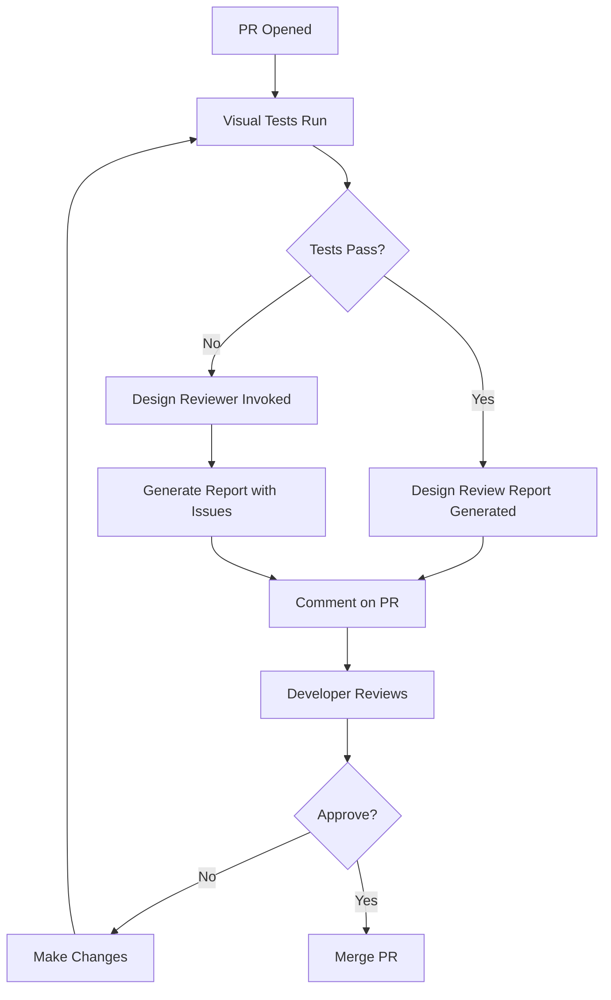

# Visual Intelligence Protocol

AI coding assistance for the NFL Pick 'Em Challenge with visual design awareness.

## 🎯 Purpose

This configuration enables AI agents (Claude, GitHub Copilot) to maintain visual design consistency while implementing features. It integrates the Supercharger Manifesto v3.1 Visual Intelligence principles.

## 🤖 Agent System

### Available Agents

1. **Design Reviewer** (`.claude/agents/design-reviewer.md`)
   - Invocation: "Review this design" or "Check visual consistency"
   - Purpose: Validates implementations against design specs
   - Output: Design review report with pass/fail criteria

2. **Design Iteration** (`.claude/agents/design-iteration.md`)
   - Invocation: "Iterate on this design" or "Improve visual design"
   - Purpose: Suggests design improvements with visual examples
   - Output: Updated components with design rationale

### Agent Triggers

Agents activate automatically when:
- PR contains UI component changes
- Visual regression tests fail
- User explicitly invokes agent
- Design specs are updated

## 📸 Screenshot Requirements

### When to Capture Screenshots

AI agents should capture screenshots when:
1. Implementing new UI components
2. Modifying existing visual elements
3. Testing responsive layouts
4. Validating design spec adherence
5. During visual regression testing

### Screenshot Standards

```bash
# Use Playwright for consistent screenshots
npx playwright screenshot \
  --viewport 1280x720 \
  --full-page \
  --output screenshots/component-name-state.png
```

**Naming Convention**: `{component}-{variant}-{viewport}.png`

Examples:
- `league-card-default-desktop.png`
- `league-card-hover-desktop.png`
- `league-card-default-mobile.png`

### Required Screenshots per Component

For each UI component, capture:
- [ ] Default state (desktop & mobile)
- [ ] Hover state (desktop)
- [ ] Active/selected state
- [ ] Disabled state
- [ ] Error state (if applicable)
- [ ] Loading state (if applicable)
- [ ] Empty state (if applicable)

## 🎨 Visual Validation Protocol

### Design Spec Alignment Check

Before implementing a component, verify:

1. **Color Tokens**: All colors from `style-guide.md`
2. **Typography**: Font sizes and weights from design system
3. **Spacing**: Using spacing scale (no arbitrary values)
4. **Border Radius**: Using defined radius tokens
5. **Shadows**: Using elevation scale
6. **Responsive**: Behavior defined for all breakpoints

### Implementation Checklist

```markdown
## Visual Design Checklist

- [ ] Colors use design tokens (no hardcoded hex values)
- [ ] Spacing uses spacing scale
- [ ] Typography matches hierarchy
- [ ] Component responsive at all breakpoints
- [ ] All states visually designed (hover, focus, error, etc.)
- [ ] Accessibility: Color contrast passes WCAG AA
- [ ] Accessibility: Focus indicators visible
- [ ] Screenshots captured for all states
- [ ] Visual regression baseline updated
```

## 🔍 Design Review Process

### Automated Review Steps

1. **Run Visual Tests**
   ```bash
   npm run test:visual
   ```

2. **Generate Design Report**
   ```bash
   npm run design-review
   ```

3. **Check Against Spec**
   - Compare implementation screenshots to design spec
   - Validate token usage
   - Check responsive behavior

4. **Accessibility Audit**
   - Run axe-core or similar tool
   - Verify keyboard navigation
   - Test with screen reader

### Manual Review Triggers

Request manual design review when:
- Visual tests fail repeatedly
- Significant design changes proposed
- New design patterns introduced
- Accessibility concerns arise

## 📐 Design System Integration

### Using Design Tokens in Code

```typescript
// ✅ Good - Use design tokens
import { tokens } from '@/styles/tokens';

const StyledButton = styled.button`
  background: ${tokens.colors.primary[500]};
  padding: ${tokens.spacing[3]} ${tokens.spacing[6]};
  border-radius: ${tokens.radius.lg};
  font-size: ${tokens.fontSize.base};
`;

// ❌ Bad - Hardcoded values
const StyledButton = styled.button`
  background: #0066cc;
  padding: 12px 24px;
  border-radius: 8px;
  font-size: 16px;
`;
```

### Token Generation

```bash
# Future: Generate CSS custom properties from style-guide.md
npm run tokens:generate

# Output: styles/tokens.css
# :root {
#   --color-primary-500: #0066cc;
#   --spacing-3: 0.75rem;
#   ...
# }
```

## 🖼️ Screenshot Comparison

### Baseline Management

```bash
# Capture new baselines
npm run test:visual -- --update-snapshots

# Review changes
git diff test-results/baseline/

# Commit if intentional
git add test-results/baseline/
git commit -m "chore: update visual baselines"
```

### Visual Diff Review

When visual tests fail:
1. Review diff images in test-results/
2. Determine if change is intentional
3. Update baseline if approved
4. Document reason for change

## 🎯 Agent-Specific Instructions

### For Design Reviewer Agent

When invoked, the agent should:

1. Load design specs from `specs/design/`
2. Capture screenshots of current implementation
3. Compare against design tokens and principles
4. Check accessibility (contrast, focus states)
5. Generate report with:
   - Pass/Fail for each criterion
   - Screenshots highlighting issues
   - Specific recommendations
   - Links to relevant spec sections

### For Design Iteration Agent

When invoked, the agent should:

1. Analyze current design state
2. Identify improvement opportunities
3. Reference design principles and patterns
4. Propose specific changes with rationale
5. Generate example code with tokens
6. Update or create screenshots
7. Document design decisions

## 🔄 Workflow Integration

### Pull Request Workflow



### Local Development Workflow

```bash
# 1. Check design spec
cat specs/design/style-guide.md

# 2. Implement component with tokens
# ... code ...

# 3. Run visual tests
npm run test:visual

# 4. Invoke design reviewer (if needed)
# "Review this design implementation"

# 5. Address feedback and iterate
# ... fixes ...

# 6. Update baselines (if approved)
npm run test:visual -- --update-snapshots

# 7. Commit changes
git add .
git commit -m "feat: implement league card component"
```

## 📊 Success Metrics

Visual Intelligence is working when:
- [ ] Visual regression tests catch unintended changes
- [ ] Design review comments are actionable and specific
- [ ] Component implementations match specs on first try
- [ ] Design token usage is 100% (no hardcoded values)
- [ ] Accessibility issues caught before manual review
- [ ] Screenshots document all component states

## 🔧 Configuration

### Playwright Visual Config

```typescript
// playwright.config.ts
export default defineConfig({
  expect: {
    toHaveScreenshot: {
      maxDiffPixels: 100,        // Allow small rendering differences
      threshold: 0.2,             // 20% threshold
    },
  },
  use: {
    screenshot: 'only-on-failure',
    trace: 'retain-on-failure',
  },
});
```

### Design Review Config

```javascript
// scripts/design-review-config.js
module.exports = {
  specPath: './specs/design',
  screenshotPath: './test-results',
  baselinePath: './test-results/baseline',
  reportPath: './design-review-report.md',
  
  checks: {
    colorTokens: true,
    spacing: true,
    typography: true,
    accessibility: true,
    responsive: true,
  },
  
  thresholds: {
    contrastRatio: 4.5,      // WCAG AA
    minFontSize: 16,          // px
    maxLineLength: 75,        // characters
  },
};
```

## 📚 Resources

- [Style Guide](../specs/design/style-guide.md)
- [Design Principles](../specs/design/design-principles.md)
- [Design Reviewer Agent](./agents/design-reviewer.md)
- [Design Iteration Agent](./agents/design-iteration.md)
- [Playwright Visual Testing](https://playwright.dev/docs/test-snapshots)

## 🎓 Training Examples

### Good Visual Implementation

```typescript
// Component follows all guidelines
export function LeagueCard({ league }: LeagueCardProps) {
  return (
    <Card
      padding={tokens.spacing[6]}
      borderRadius={tokens.radius.lg}
      shadow={tokens.shadow.md}
    >
      <Heading
        size={tokens.fontSize['2xl']}
        weight={tokens.fontWeight.semibold}
        color={tokens.colors.neutral[900]}
      >
        {league.name}
      </Heading>
      <Text
        size={tokens.fontSize.base}
        color={tokens.colors.neutral[600]}
      >
        {league.memberCount} members
      </Text>
      <Button
        variant="primary"
        size="md"
        onClick={() => joinLeague(league.id)}
      >
        Join League
      </Button>
    </Card>
  );
}
```

### Screenshot Coverage Example

```
test-results/baseline/
├── league-card/
│   ├── default-desktop.png
│   ├── default-mobile.png
│   ├── hover-desktop.png
│   ├── loading-desktop.png
│   └── error-desktop.png
├── league-list/
│   ├── empty-desktop.png
│   ├── populated-desktop.png
│   └── populated-mobile.png
└── ...
```

---

**Last Updated**: 2025-10-15  
**Version**: 3.1.0  
**Status**: Active
