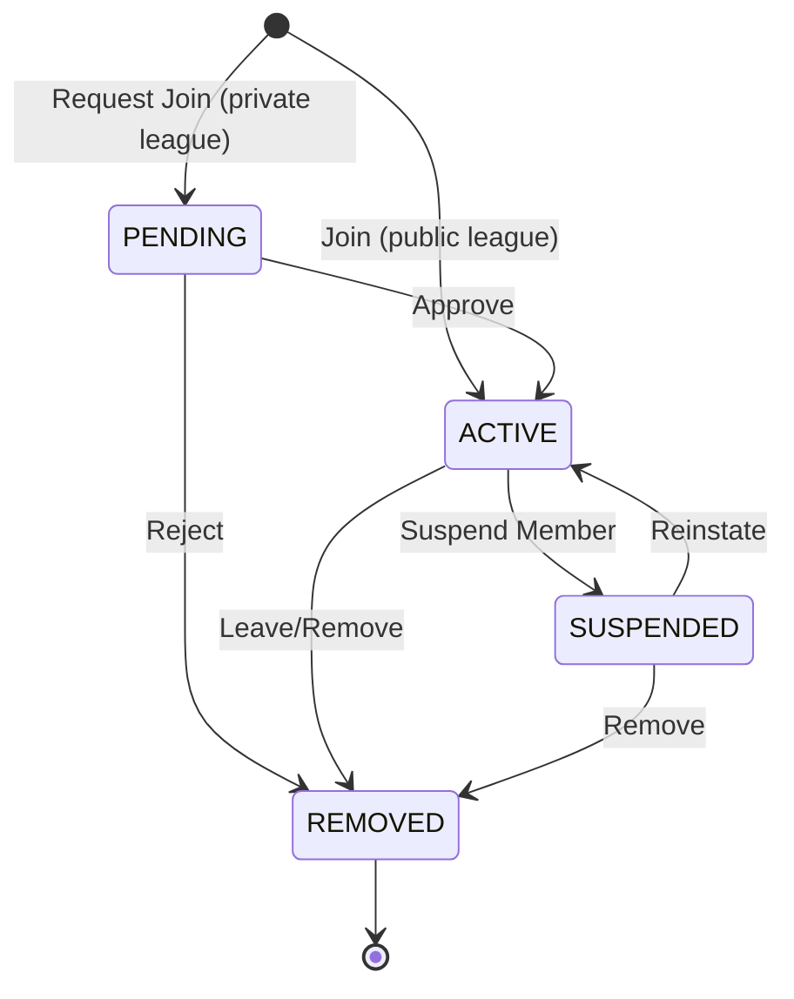

# League Membership Feature Specification

## Overview

The League Membership feature manages the relationship between users and leagues in the NFL Pick 'Em Challenge. This specification defines the business rules, state management, and invariants that ensure data integrity across league operations.

## User Stories

### Primary Users
- **League Creator**: As a league creator, I want to manage my league's membership so that I can control who participates
- **League Member**: As a league member, I want to join leagues and see my membership status so that I can participate in challenges
- **Visitor**: As a visitor, I want to browse public leagues so that I can find groups to join

## Business Rules & Invariants

### Core Invariants

These rules MUST hold at all times:

1. **Membership Uniqueness**: A user can only be a member of a league once
   - Validation: `UNIQUE(league_id, user_id)` at database level
   - Error: "User already member of this league"

2. **Member Count Accuracy**: League member count must always equal the number of active memberships
   - Invariant: `league.member_count == COUNT(memberships WHERE league_id = league.id AND status = 'active')`
   - Reconciliation: Background job validates and fixes discrepancies

3. **Creator is Always Member**: The league creator is automatically a member with 'owner' role
   - Applied: On league creation
   - Immutable: Creator membership cannot be removed

4. **Active Membership Required**: Only users with active membership can submit picks
   - Validation: Check membership status before pick submission
   - Error: "Must be an active member to submit picks"

5. **Persistence Across Sessions**: League memberships persist across user logout/login cycles
   - Implementation: Database-backed, not session-dependent
   - Fallback: File-based storage for development

### Membership States

```
PENDING    -> User requested to join, awaiting approval
ACTIVE     -> Full member, can submit picks
SUSPENDED  -> Temporarily restricted, cannot submit picks
REMOVED    -> No longer a member, historical record only
```

### State Transitions



### Validation Rules

**On Join Request:**
- User must be authenticated
- League must exist and not be archived
- User not already a member (any status)
- League capacity not exceeded (if set)
- Invite code correct (if required)

**On Membership Approval:**
- Membership must be in PENDING state
- Approver must be league owner or admin
- League still accepting members

**On Member Removal:**
- Cannot remove league creator
- Remover must be owner or removing self
- Historical picks remain intact

## Data Model

### LeagueMembership Schema

```typescript
interface LeagueMembership {
  id: string;                    // UUID
  league_id: string;             // Foreign key to League
  user_id: string;               // Foreign key to User
  status: MembershipStatus;      // PENDING | ACTIVE | SUSPENDED | REMOVED
  role: MemberRole;              // OWNER | ADMIN | MEMBER
  joined_at: Date;               // Timestamp of joining
  updated_at: Date;              // Last status change
  removed_at: Date | null;       // Timestamp if removed
  removed_by: string | null;     // User who removed (if applicable)
}

type MembershipStatus = 'PENDING' | 'ACTIVE' | 'SUSPENDED' | 'REMOVED';
type MemberRole = 'OWNER' | 'ADMIN' | 'MEMBER';
```

### League Schema (Membership Fields)

```typescript
interface League {
  // ... other fields
  member_count: number;          // Cached count of ACTIVE members
  max_members: number | null;    // Optional capacity limit
  is_private: boolean;           // Requires approval to join
  invite_code: string | null;    // Required code for joining
}
```

## API Contract

### Get League Members

```
GET /api/leagues/:leagueId/members
```

**Query Parameters:**
- `status`: Filter by membership status (default: 'ACTIVE')
- `page`: Page number (default: 1)
- `limit`: Results per page (default: 20)

**Response:**
```json
{
  "members": [
    {
      "id": "mem_123",
      "user": {
        "id": "user_456",
        "username": "johndoe",
        "display_name": "John Doe"
      },
      "role": "MEMBER",
      "status": "ACTIVE",
      "joined_at": "2025-10-01T12:00:00Z"
    }
  ],
  "total": 42,
  "page": 1,
  "total_pages": 3
}
```

### Join League

```
POST /api/leagues/:leagueId/join
```

**Request:**
```json
{
  "invite_code": "ABC123"  // Optional, required if league.is_private
}
```

**Response (Public League):**
```json
{
  "membership": {
    "id": "mem_789",
    "status": "ACTIVE",
    "role": "MEMBER",
    "joined_at": "2025-10-15T12:26:00Z"
  },
  "league": {
    "id": "league_123",
    "name": "Office Pool",
    "member_count": 43
  }
}
```

**Response (Private League):**
```json
{
  "membership": {
    "id": "mem_789",
    "status": "PENDING",
    "role": "MEMBER",
    "joined_at": "2025-10-15T12:26:00Z"
  },
  "message": "Join request pending approval"
}
```

### Leave League

```
DELETE /api/leagues/:leagueId/members/:userId
```

**Authorization:** User must be removing self, or be league owner

**Response:**
```json
{
  "success": true,
  "message": "Successfully left league"
}
```

## UI/UX Requirements

### League List View
- Display member count prominently
- Show "Join" button for non-members
- Show "Pending" status if join requested
- Show "Member" badge if already joined

### League Detail View
- Member list with avatars and roles
- Member count visible in header
- Join/Leave button contextual to status
- Admin actions (approve/remove) if authorized

### Member Management (Admins)
- Pending approvals prominently displayed
- Bulk actions for approval/rejection
- Member search and filter
- Role assignment interface

### Responsive Behavior
- Mobile: Simplified member list (name + role only)
- Tablet: Add join date
- Desktop: Full details + admin actions inline

## Test Scenarios

### Critical Path Tests

1. **Join Public League**
   - Given: Authenticated user, public league exists
   - When: User clicks "Join"
   - Then: Membership created with ACTIVE status, member_count incremented

2. **Join Private League**
   - Given: Authenticated user, private league exists
   - When: User submits join request with valid invite code
   - Then: Membership created with PENDING status, owner notified

3. **Persistence Test**
   - Given: User is member of league
   - When: User logs out and logs back in
   - Then: Membership still shows as ACTIVE, can submit picks

4. **Member Count Accuracy**
   - Given: League with N members
   - When: User joins league
   - Then: `league.member_count == N + 1`
   - And: Count matches `SELECT COUNT(*) FROM memberships WHERE status = 'ACTIVE'`

5. **Duplicate Prevention**
   - Given: User already member of league
   - When: User attempts to join again
   - Then: Error returned, no duplicate membership created

6. **Creator Protection**
   - Given: User is league creator
   - When: Attempt to remove creator membership
   - Then: Error returned, creator remains member

### Edge Cases

7. **Leave and Rejoin**
   - Given: User previously left league (status = REMOVED)
   - When: User joins again
   - Then: New membership created (new ID), old membership preserved

8. **Concurrent Joins**
   - Given: Multiple users join same league simultaneously
   - When: All join requests processed
   - Then: Member count accurate, no race conditions

9. **Capacity Limit**
   - Given: League at max capacity
   - When: User attempts to join
   - Then: Error returned, membership not created

## Background Jobs

### Member Count Reconciliation

**Schedule**: Every 5 minutes

**Purpose**: Detect and fix member count discrepancies

**Algorithm**:
```
FOR each league:
  actual_count = COUNT(memberships WHERE status = 'ACTIVE')
  IF league.member_count != actual_count:
    LOG discrepancy
    UPDATE league SET member_count = actual_count
    EMIT reconciliation_event
```

### Cleanup Expired Pending Requests

**Schedule**: Daily at 2 AM

**Purpose**: Auto-reject old pending requests

**Logic**:
```
UPDATE memberships
SET status = 'REMOVED', removed_at = NOW()
WHERE status = 'PENDING'
  AND joined_at < NOW() - INTERVAL '30 days'
```

## Security Considerations

1. **Authorization Checks**: Verify user can perform action on membership
2. **Rate Limiting**: Limit join requests per user per hour
3. **Invite Code Protection**: Hash invite codes, limit attempts
4. **SQL Injection**: Use parameterized queries
5. **Mass Assignment**: Whitelist allowed fields on updates

## Performance Optimizations

1. **Indexing**:
   - `INDEX (league_id, status)` for member lists
   - `INDEX (user_id, status)` for user's memberships
   - `UNIQUE INDEX (league_id, user_id)` for uniqueness

2. **Caching**:
   - Cache member count in league record
   - Cache user's active memberships in session
   - Invalidate on membership changes

3. **Pagination**: Limit member lists to prevent large responses

## Migration Path

From current implementation to spec:

1. ✅ Add membership status enum
2. ✅ Add member_count column to leagues
3. ✅ Create background reconciliation job
4. ⬜ Add capacity limits
5. ⬜ Implement private leagues with approval flow
6. ⬜ Add role-based permissions

## Related Specifications

- [Authentication & Sessions](./authentication.spec.md) (future)
- [Pick Submission](./pick-submission.spec.md) (future)
- [League Management](./league-management.spec.md) (future)

## References

- [League Persistence Fix](../../../LEAGUE_PERSISTENCE_FIX_COMPLETE.md)
- [CI/CD Quality Gates](../../../docs/ci-cd/README.md)

---

**Last Updated**: 2025-10-15  
**Version**: 1.0.0  
**Status**: Active
